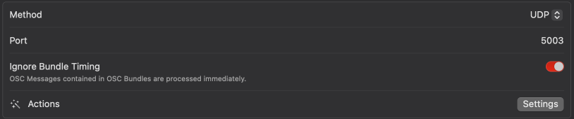

# X32/M32 Vor Adapter

Make your X32 talk to Vor

## Status

___Working___, in testing.  My test rig has a wired ethernet to the X32, and VOR is on the same machine.

## Overview

### Terminal View


### Vor View


_World's cheapest webcam, sorry_

## Synopsis

```shell
$ npm start [--verbose] x32_address
$ npm start [--verbose] --listen cue dca bus --ip x32_address
$ npm start --help
```

## X32 Configuration

```plain
--ip address      IP Address of the X32 [required]
-p, --port port   Port of the X32 (10023)
```

## Vor Configuration

```plain
-l, --listen item ...   Updates to populate to Vor.
                        Items: cue, dca, dca1 - dca8, bus, bus01 - bus16.
                        Default is cue, dca
--vorIP address         IP for Vor (127.0.0.1)
-o, --vorPort port      Port for Vor (3333)
--vorFreq ms            Vor update frequency in milliseconds (100ms) (100ms for changes, every 10th time everything is sent)
--vorJitter ms          Vor jitter frequency in milliseconds (50ms)
```

## Options

```plain
--help           Print this usage guide.
-v, --verbose    Print lots of debug data
-d, --debug      Print all incoming X32 OSC messages (implicit --noGUI)
--noGUI          Suppress usual display
```

## Cues, Scenes or Snippets

X32_Vor will load the "cue list" with whatever the show_control setting on the X32 is.

## Packet Size and Jitter

Because OSC uses UDP with all of the technical considerations and limits that implies, it is important to set your __--listen__ directive with the minimum you need.

__The maximum safe UDP payload is 508 bytes.__ This is a packet size of 576 (the "minimum maximum reassembly buffer size"), minus the maximum 60-byte IP header and the 8-byte UDP header.

If your packet size exceeds the maximum above, it will be fragmented - on a local network, this is probably still fine (including local loopback), but if one fragment fails to deliver, the entire packet is dropped.  Because X32Vor transmits the entire state each send 10th send window (those windows between only what has changed sends), in practice, this is probably fine - but if you notice a lot of stutter in the data, try reducing the amount of measurements you are listening to.

Likewise, it takes some amount of time for the UDP packet to arrive - and each packet is timestamped 50ms in the future (by default) - if it arrives after this time, it will be ignored (configurable in VOR).  If your stream jitters, you can try increasing this time offset.

## Install (mac)

### Install Node.js

1. create `~/.zprofile` if it does not already exist (default mac shell is zsh - if you've changed it, you likely already have a .profile or .bashrc or whatever.)

```shell
$ touch ~/.zprofile
```

2. install nvm (Node Version Manager)

```shell
$ curl -o- https://raw.githubusercontent.com/nvm-sh/nvm/v0.39.7/install.sh | bash
```

3. restart the terminal and install node.js

```shell
$ nvm install 20
```

4. Verify installation

```shell
$ node -v 
v20.14.0
$ npm -v 
10.7.0
```

### Clone or download the repository as a ZIP

Use GIT to clone the repository, or, download the source ZIP file from GitHub

### Install Dependencies

In the folder of the repository (or the unzipped files), run `npm`

```shell
$ npm install
```

### Run The program

```shell
$ npm start [X32_IP_Address] [options]
```

### Configure VOR

Add a [Custom OSC](https://docs.getvor.app/vor/settings/connections/show-control/custom-osc) connection of type UDP.



By default, X32_Vor uses port 3333, but you can use whatever you want as a command line option __--vorPort=4444__.  Outputting to VOR on a different physical address is possible with the __--vorIP__ option.  This has been briefly tested with Vor Mobile

### Add VOR addresses

Add any of the available address endpoints. They must be configured with the __--listen__ option (or in the defaults).  All addresses return only strings

Available:

* /currentCue _[cue number] [cue name]_
* /dca/__[dca number]__ _[level] [on/off] [name]_
* /bus/__[bus number]__ _[level] [on/off] [name]_

___Note: Bus number must be zero-padded, e.g. `/bus/01`, not `/bus/1`___


## Coverage

This is a list with processed arguments of what OSC messages X32_Vor processes. Everything else is silently ignored. Some of these are `node` messages - the real message is in the first string argument of the `node` address - not the lack of preceding slash

### Cues

```plain
/-prefs/show_control [i~index of](!OR!)[s~CUES,SCENES,SNIPPETS] (all referred to as cues by X32Vor)
/-show/prepos/current [i~current cue index]
/-show/showfile/show (no args processed, when seen, clear internal cue list)
/-show/showfile/cue/[cueIndex] [i~cueNumber] [s~cue Name] (others ignored)
```

### DCAs

```plain
/dca/[1-8] [s~ON/OFF] [s~level in dB]
/dca/[1-8]/config [s~DCA Name] (others ignored)
/dca/[1-8]/config/name [s~DCA Name]
/dca/[1-8]/on [i~ON/OFF bool]
/dca/[1-8]/fader [f~level in float]
```

### BUSes

```plain
/bus/[01-16]/mix [s~ON/OFF] [s~level in dB] (others ignored)
/bus/[01-16]/mix/fader [f~level in float]
/bus/[01-16]/mix/on [i~ON/OFF bool]
/bus/[01-16]/config [s~DCA Name] (others ignored)
/bus/[01-16]/config/name [s~DCA Name]
```

## Actual workflow

Pseudo-code follows, for anyone looking to do something simlar for the X32/M32 series

### Boilerplate

```js
function sendToX32(oscAddress, parameter1, parameter2, ...) { /* ... */ }
```

### Startup
```js
sendToX32('/node', '-prefs/show_control'))
sendToX32('/node', '-show/prepos/current')
sendToX32('/node', 'dca/[1-8]')
sendToX32('/node', 'dca/[1-8]/config')
sendToX32('/node', 'bus/[01-16]')
sendToX32('/node', 'bus/[01-16]/config')
sendToX32('/showdata')
sendToX32('/xremote')
```

### Repeat every keepAlive (5000ms)
```js
sendToX32('/xremote')
```

### Repeat every keepAlive * 10 (50,000ms)

Or, when an event is received where we thing the cue list has changed - this includes cue/scene/snippet save/delete/edit

```js
sendToX32('/showdata')
```

## How about a binary?

Maybe. I don't have the foggiest idea on the state of Node.js build tools for CLI stuff.

## Issues?

Open a ticket, or find me on the VOR or TGR discord groups.

## Licensing

"Can I do...?" -> sure. go for it. If you can, and it might be useful to others, send a pull request to include it in the repo.

As a rule, I always prefer optional behavior - e.g. levels are in dB right now, but if you wanted the raw number, add it as an option rather than changing existing functionality.
