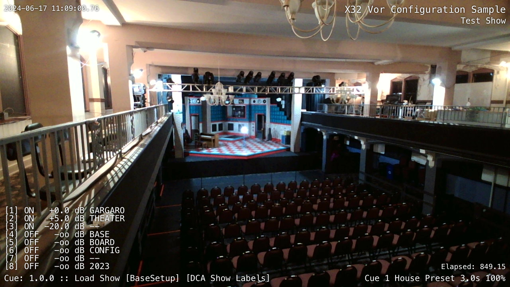
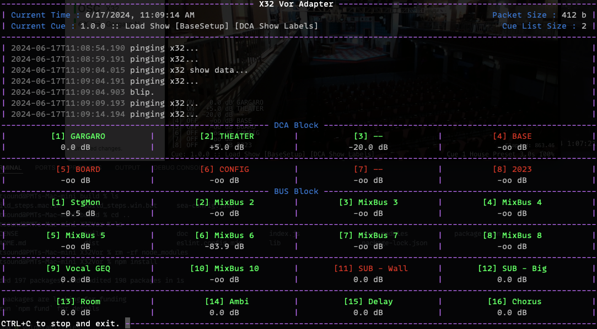
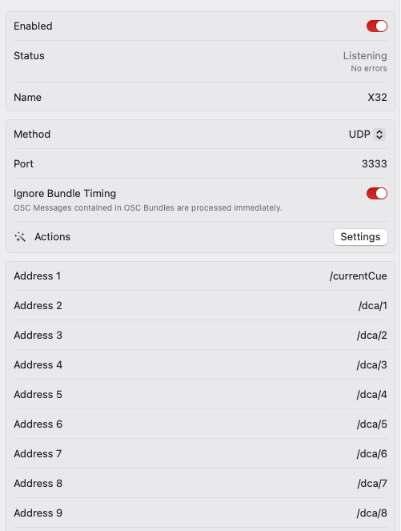

# X32/M32 Vor Adapter

Make your X32 talk to Vor (or anything else that reads custom OSC I suppose)

## Status

___Working___, in testing.  My test rig has a wired ethernet to the X32, and VOR is on the same machine.

## Overview



### Terminal View

X32Vor has a pretty ansi styled terminal to show it's working.  It even sizes itself to fit as best it can.



### Synopsis

```shell
$ node index.js --ip x32_address
$ node index.js --config config.file.json
$ node index.js --help
```

### X32 Configuration

```plain
-i, --ip address              IP Address of the X32 [required]
```

### Vor Configuration

```plain
-o, --vor-ip address          IP for Vor (127.0.0.1)
-o, --vor-port port           Port for Vor (3333)
```

### Options

```plain
-c, --config config.json      Read configuration from a file
-w, --write new.config.json   Write configuration to a file
--no-gui          Suppress the ansi terminal display
```

## Configuration

X32Vor might be configured just fine out of the box. But, the easiest way to mess with things is to launch the script with the `--write` option and edit the file.  You'll need to provide _at least_ a X32 IP address to write the file.

If you name your configuration file `x32_vor.config.json`, it will be automatically loaded at startup (unless another configuration file is specified)

X32Vor tracks cues, scenes, snippets, dca's, and busses. The `vor.output` directive controls which of these are __sent__ to Vor - the valid options are `cue`, `dca`, `bus`, `dca1`->`dca8`, and `bus01`->`bus16`

For more detailed information on the rest of the possible settings, take a look at the [default settings](https://github.com/jtsage/X32_Vor/blob/main/lib/default_settings.js)

## Cues, Scenes or Snippets

X32Vor sends the current cue string that is appropriate to the X32 Show Control setting.

## Packet Size and Jitter

Because OSC uses UDP with all of the technical considerations and limits that implies, it is important to set your `vor.output` directive with the minimum you need.

__The maximum safe UDP payload is 508 bytes.__ This is a packet size of 576 (the "minimum maximum reassembly buffer size"), minus the maximum 60-byte IP header and the 8-byte UDP header.

If your packet size exceeds the maximum above, it will be fragmented - on a local network, this is probably still fine (including local loopback), but if one fragment fails to deliver, the entire packet is dropped.  Because X32Vor transmits the entire state each send 10th send window (those windows between only what has changed sends), in practice, this is probably fine - but if you notice a lot of stutter in the data, try reducing the amount of measurements you are listening to.

Likewise, it takes some amount of time for the UDP packet to arrive - and each packet is timestamped 50ms in the future (by default) - if it arrives after this time, it will be ignored (configurable in VOR).  If your stream jitters, you can try increasing this time offset.

## Install (macOS)

Windows is similar, but Vor does not run on Windows PC's - you still may want to use a windows machine if you need to process the X32 messages on somewhere else - X32Vor can broadcast the Vor packets to a network address other than localhost.

### Install Node.js

create `~/.zprofile` if it does not already exist (default mac shell is zsh - if you've changed it, you likely already have a .profile or .bashrc or whatever.)

```shell
$ touch ~/.zprofile
```

install nvm (Node Version Manager)

```shell
$ curl -o- https://raw.githubusercontent.com/nvm-sh/nvm/v0.39.7/install.sh | bash
```

restart the terminal and install node.js

```shell
$ nvm install 20
```

Verify installation

```shell
$ node -v 
v20.14.0
$ npm -v 
10.7.0
```

### Clone the repository, or download the repository as a ZIP

Use GIT to clone the repository, or, download the source ZIP file from GitHub

```shell
$ git clone https://github.com/jtsage/X32_Vor.git
```

### Install Dependencies

In the folder of the repository (or the unzipped files), run `npm`

```shell
$ npm install
```

### Create a configuration file

```shell
$ node index.js -i [X32_IP_Address] -w x32_vor.config.json
```

### Configure VOR

Add a [Custom OSC](https://docs.getvor.app/vor/settings/connections/show-control/custom-osc) connection of type UDP.



By default, X32Vor uses port 3333, but you can use whatever you want as a command line switch __-p 4444__ (Option `vor.port`).  Outputting to VOR on a different physical address is possible with the __-o 10.1.1.10__ switch (Option `vor.address`).  This has been briefly tested with Vor Mobile

### Add VOR addresses

Add any of the available address endpoints. They must be configured with the `vor.output` option (or in the defaults).  All addresses return only strings

Available:

* /currentCue _[cue string]_
* /dca/__[dca number]__ _[single fader string]_
* /bus/__[bus number]__ _[single fader string]_

The fader string can be set with the `vor.singleStringFormat` option. If you prefer to do more layout work in Vor, you can have faders sent as three strings instead by setting `vor.singleStringMode` to `false` to get:

* /bus/__[bus number]__ _[level] [on/off] [name]_

___Note: Bus number must be zero-padded, e.g. `/bus/01`, not `/bus/1`___

### Setup Layout

Example shown for current cue.


## Coverage

This is a list with processed arguments of what OSC messages X32_Vor processes. Everything else is silently ignored. Some of these are `node` messages - the real message is in the first string argument of the `node` address - not the lack of preceding slash

### Cues

```plain
/-prefs/show_control [i~index of](!OR!)[s~CUES,SCENES,SNIPPETS] 
/-show/prepos/current [i~current cue/scene/snippet index]
/-show/showfile/show (no args processed, when seen, clear internal cue list)
/-show/showfile/cue/[index] [i~cueNumber] [s~cue Name] [i~skip?] [i~scene index] [i~snippet index] 
/-show/showfile/scene/[index] [s~scene name] [s~scene note] 
/-show/showfile/snippet/[index] [s~snippet Name] 
```

### DCAs

```plain
/dca/[1-8] [s~ON/OFF] [s~level in dB]
/dca/[1-8]/config [s~DCA Name] (others ignored)
/dca/[1-8]/config/name [s~DCA Name]
/dca/[1-8]/on [i~ON/OFF bool]
/dca/[1-8]/fader [f~level in float]
```

### BUSes

```plain
/bus/[01-16]/mix [s~ON/OFF] [s~level in dB] (others ignored)
/bus/[01-16]/mix/fader [f~level in float]
/bus/[01-16]/mix/on [i~ON/OFF bool]
/bus/[01-16]/config [s~DCA Name] (others ignored)
/bus/[01-16]/config/name [s~DCA Name]
```

## Actual workflow

Pseudo-code follows, for anyone looking to do something similar for the X32/M32 series

### Boilerplate

```js
function sendToX32(oscAddress, parameter1, parameter2, ...) { /* ... */ }
```

### Startup

Get the show control mode, current cue index, and show data.  Get the fader, mute, and name status for all DCA's and BUS's

```js
sendToX32('/node', '-prefs/show_control'))
sendToX32('/node', '-show/prepos/current')
sendToX32('/showdata')
sendToX32('/node', 'dca/[1-8]')
sendToX32('/node', 'dca/[1-8]/config')
sendToX32('/node', 'bus/[01-16]')
sendToX32('/node', 'bus/[01-16]/config')
sendToX32('/xremote')
```

### Repeat every keepAlive < 10sec

The X32 times out the `xremote` command after 10 seconds. X32Vor re-sends every 5 seconds just to be sure.

```js
sendToX32('/xremote')
```

### Repeat every keepAlive ~ 1min

Or, when an event is received where we think the cue list has changed - this includes cue/scene/snippet save/delete/edit

```js
sendToX32('/showdata')
```

## How about a binary?

Sure.  Check the dist folder.

## Issues?

Open a ticket, or find me on the VOR or TGR discord groups.

## Licensing

"Can I do...?" -> sure. go for it. If you can, and it might be useful to others, send a pull request to include it in the repo.

As a rule, I always prefer optional behavior - e.g. levels are in dB right now, but if you wanted the raw number, add it as an option rather than changing existing functionality.
